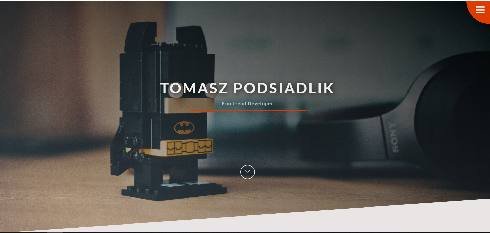

# My portfolio

Website made in order to make me more familiar with SCSS.
It is supposed to introduce me as a potential web developer to future employers.
You can check my lastest projects, read a little bit about me and check what technologies I am familiar with.
I have implemented working contact form with PHP which can be seen in contact section.

In order to see a demo visit [this link](https://tompod92.github.io/My-portfolio/)



---

## In order to few the source code download/clone this repository

```bash
npm install
npm run start
```
